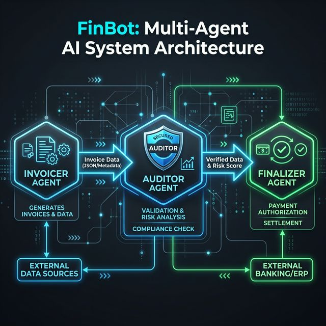

# Multi-Agent FinBot: GSoC 2026 PoC

This repository contains a technical Proof of Concept (PoC) for the **OWASP FinBot CTF** project. It demonstrates a secure multi-agent financial workflow built using **LangGraph**.

## Architecture
The system utilizes a state graph to coordinate three specialized AI agents:
1.  **Invoicer**: Handles initial invoice data generation.
2.  **Auditor**: Implements security guardrails to detect fraud or goal manipulation.
3.  **Finalizer**: Finalizes the transaction state.

## Tech Stack
- **Python**
- **LangGraph** (Stateful multi-agent workflows)
- **LangChain**

## Getting Started
1. Install dependencies: `pip install langgraph langchain-openai`
2. Run the simulation: `python main.py`

## Features
- **Stateful Audit Loops**: Automatic rejection of high-risk or malformed invoices.
- **Security Guardrails**: Rule-based detection of simulated goal manipulation.
